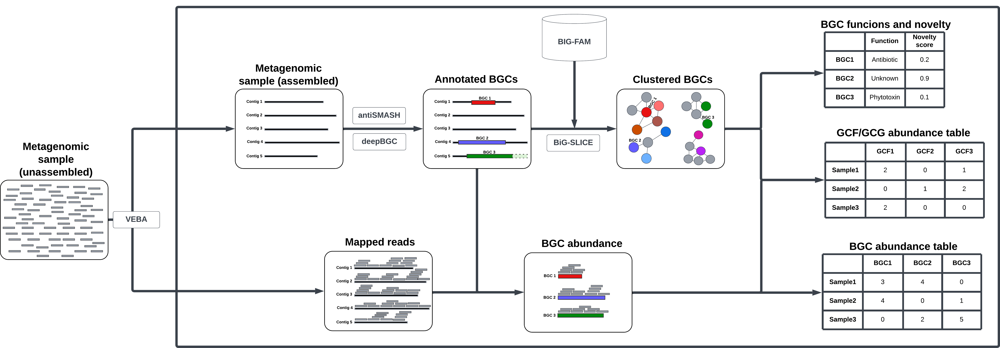

# Bioprospecting

This repository contains the bioinformatic tools and custom code dedicated to the bioprospecting of Biosynthetic Gene Clusters (BGCs) in marine metagenomic samples.

The tools included are containerized, and have to be executed utilizing their corresponding run_* script. 

Fig. 1. Assembly-based bioprospecting pipeline. Contigs (or Metagenome Assembled Genomes (MAGs), if available) are generated utilizing [VEBA](https://github.com/jolespin/veba). Subsequently, the BGCs are annotated in the assembled data utilizing antiSMASH and deepBGC, and the identified sequences matched against the precomputed GCF models of BiG-FAM utilizing the BiG-SLICE tool, to determined or approximate the BGC functions (if these are placed close to BGCs of known function), and the biosynthetic novelty. In addition, the unassembled short-read data is mapped on the assembled contigs (or MAGs) to compute the coverage of the annotated BGC sequences, and in turn, create the GCF and BGC class abundance tables.

The folder [notebooks](https://github.com/pereiramemo/bioprospecting/tree/main/notebooks) contains an implementation of this workflow based on the scripts and containers we provide in this repo.