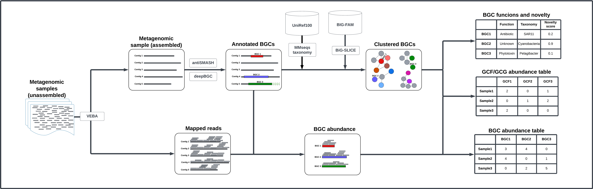

# Bioprospecting

This repository contains the bioinformatic tools and custom code dedicated to the bioprospecting of Biosynthetic Gene Clusters (BGCs) in marine metagenomic samples.

The tools included are containerized, and have to be executed utilizing their corresponding run_* script. 

<a name="figure1">
</a>



**Fig. 1**. Assembly-based bioprospecting pipeline. The input data consists of metagenomic samples previously preprocessed and assembled utilizing [VEBA](https://github.com/jolespin/veba). The pipeline is organized in five main tasks. **1) Identify BGC sequences:** the BGCs are annotated in the assembled metagenomic data utilizing [antiSMASH](https://github.com/antismash/antismash); **2) Taxonomic annotation:** the metagenomic contigs containing BGC sequences are taxonomically annotated utilizing [MMseqs taxonomy](https://github.com/soedinglab/MMseqs2#taxonomy) and the reference database [UniRef100](https://www.uniprot.org/help/uniref); **3) BGC mapping:** the metagenomic BGC sequences are mapped against (previously constructed) Gene Cluster Family (GCF) models of the MIBiG database v3 [MIBiG v3](https://mibig.secondarymetabolites.org/) utilizing [BiG-SLICE](https://github.com/pereiramemo/bigslice); **4) BGC clustering:** the metagenomic BGC sequences are clustered into GCFs with [BiG-SLICE](https://github.com/pereiramemo/bigslice); **5) Compute coverage:** the coverage of the metagenomic contigs, previously estimated with [VEBA](https://github.com/jolespin/veba), is utilized to determine the coverage of the BGC sequences. The output of the pipeline consists of the following tables: **Table 1:** functional and taxonomic annotation, biosynthetic novelty, and closest GCF id; **Table 2:** BGC class abundance table; **Table 3:** GCFs abundance table.

### Repository structure
```
.
├── execution
│   ├── bgc_annotation
│   │   ├── antismash_execution.ipynb
│   │   └── src
│   │       ├── antismash_Dockerfile
│   │       ├── requirements.txt
│   │       ├── run_antismash.sh
│   │       └── utilitites.ipynb
│   ├── bgc_clustering
│   │   ├── bigslice_execution.ipynb
│   │   └── src
│   │       ├── bigslice_Dockerfile
│   │       ├── requirements.txt
│   │       ├── run_bigslice.sh
│   │       └── utilitites.ipynb
│   ├── bgc_mapping
│   │   ├── bigslice_execution.ipynb
│   │   └── src
│   │       ├── bigslice_Dockerfile
│   │       ├── requirements.txt
│   │       ├── run_bigslice.sh
│   │       └── utilities.ipynb
│   └── bgc_taxonomy
│       ├── mmseqs_execution.ipynb
│       └── src
│           ├── mmseqs_Dockerfile
│           ├── requirements.txt
│           ├── run_mmseqs_taxonomy.sh
│           └── utilities.ipynb
├── figures
│   └── Bioprospectig_reads_vs_assembly_dev.png
└── README.md
```

The execution folder contains all the modules that compose the bioprospecting pipeline. These are: bgc_annotation, bgc_clustering,  bgc_mapping, and bgc_taxonomy.  
Each of these modules consist of a folder with the following files:
The `*_execution.ipynb` NB: which contains the code and documentation necessary to run the analysis.]
The `src` folder with the following files:
  `*_Dockerfile` to create the container to run the main tool(s) to be executed in a module.
  `requirements.txt` a list of all the packages needed to run the `*_execution.ipynb` NB.
  `utilities.ipynb` the definition of all the functions to be utilized in the `*_execution.ipynb` NB.
   `run_*.sh` a wrap script to easily execute the containerized tool(s).


